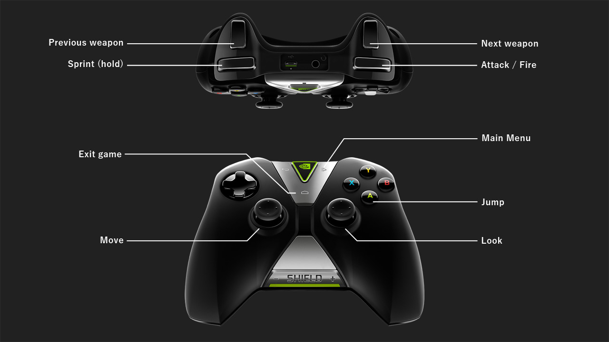

# Building on Android

## Prerequisites

- [Android NDK r11b](http://developer.android.com/ndk/downloads/index.html) (or newer) - Somewhere in your search path
- vkQuake is built against API level 23 (requires the SDK Platform installed)
- Python (Used for the build files)

## A note on SDL2
Even though the Android port uses the native app glue for input and asset management it stell needs SDL2 to compile. 
The repository contains a prebuild `libSDL2.a` static library for `arm-v7`. If you need this for a different platform or want to update, run the `buildstatic.py` script from the `jni/SDL2` subfolder. 

## PAK files
Put the `id1` folder containing the `.pak` files in the root folder of your external storage (or internal, if the device has no external storage). vkQuake will then load the files from that folder at startup.


## Device support
- **To run these examples you need a device with an Android image that suports Vulkan**
- Builds currently only support `arm-v7`, x86 may follow at a later point
- Android TV leanback launcher is supported
- Gamepad support

## Missing stuff
- Sound
- Keyboard input
- Touch input

## Default controller layout
The game will create a default.cfg at start with a control layout optimized for gamepad use:



## Building

### Prepare SDK

```
setup.py
```

Will prepare the build for API level 23, generating a few files required for the build process.

### Build (and deploy)

```
build.py (-deploy)
```

If successful, the build process will output the `vkQuake.apk` to the Android directory.

Use the "deploy" switch (if a device is connected) to install the apk after the build.

